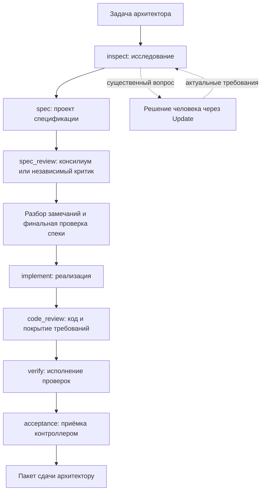

# Как работает учебная агентная фабрика

На входе — задача и границы полномочий. На выходе — реализация, проверенная по принятой спецификации, и пакет для архитектурной приёмки. Внутри агенты исследуют проект, предлагают решение, спорят с ним, исправляют слабые места, пишут код и готовят доказательства. За передачу между стадиями отвечает bsl-flow.

Это наш учебный вариант **dark-factory**: автоматизированный инженерный процесс с редкими содержательными решениями человека. Степень автоматизации зависит от реально доступных исполнителей и проверок. Подготовка стенда описана в [lab.md](lab.md); здесь разбирается сам процесс.

## Твоя роль

Ты отвечаешь за цель, существенные ограничения, разрешённый контур и достаточность результата. Умение читать BSL остаётся полезным для спорного решения, но писать весь код, вручную пересылать материалы между ролями и запускать каждый тест — обязанности, которые ты передаёшь системе.

| Решение архитектора | Работа агентной системы |
|---|---|
| Что должно измениться для пользователя | Исследовать реальные исходники и предложить способ изменения |
| Какие правила нельзя нарушить | Сформулировать требования, контрпримеры и проверяемые критерии |
| Где и что разрешено исполнять | Подготовить задачу, изоляцию и допустимые проверки |
| Как разрешить содержательную неоднозначность | Собрать варианты, их последствия и один конкретный вопрос |
| Достаточно ли доказательств для приёмки | Связать требования, код, замечания и результаты проверки |

Если смысл и полномочия уже определены, агент продолжает работу сам. Обычное исправление кода в согласованных границах не требует нового одобрения каждого шага.

## Реальный маршрут bsl-flow

Ниже порядок стадий, проверенный по локальному контракту и коду контроллера 27 сентября 2026 года. Разбор замечаний и финальная проверка спецификации входят внутрь `spec_review`.

**Код-ревью в текущем контроллере идёт перед выполнением проверок.** Ревьюер оценивает реализацию и то, способны ли заявленные тесты доказать требования. Затем `verify` получает фактические результаты. В нашем курсе после этого отдельный рецензент сверяет весь пакет сдачи: это дополнительное поручение только на чтение, а не встроенная стадия «post-test review» или замена receipt контроллера. Ведущий включает его в исходный план, чтобы архитектор получил уже проверенный пакет.

Проверяющий пакет не редактирует код. Если по его замечанию нужны изменения, они возвращаются в управляемую задачу и проходят затронутые проверки заново. Положительный отзыв о старой ревизии не покрывает новый diff.

## Что делает консилиум

Автор спецификации сначала исследует задачу и создаёт проект решения. Консилиум получает этот проект и ищет слабые места: соответствие исходной цели, архитектурные риски, исполнимость и достаточность проверок. Председатель разбирает замечания и фиксирует итог; контроллер проверяет инварианты финального документа.

Это не голосование до единогласия. Для каждого замечания есть решение: учесть, отклонить с обоснованием либо вынести существенный вопрос архитектору. Несколько одинаковых ответов не превращают предположение в факт.

Маршрут зависит от риска: обычный M использует одного независимого критика, L или high-risk — Council. В учебных задачах о списании, стоимости и конкуренции профиль повышенного риска обосновывается последствиями неверных движений. Автор стенда фиксирует классификацию и готовность провайдеров заранее; нельзя назвать обычный single review консилиумом или повысить классификацию только ради зрелищности.

В курсе Council должен быть реально наблюдаем хотя бы в первом и третьем проектах. Для второго маршрут следует принятой оценке риска. Недоступный обязательный консилиум — остановка; преподаватель или ведущий агент не изображает его результат за отсутствующих участников.

## Что делает SDD рабочим

Спецификация связывает намерение с проверкой. Агентная система сохраняет исходную задачу, версию правил, требования с устойчивыми идентификаторами и наблюдения, которыми они будут проверяться. Для повышенного риска нужны и обоснованные архитектурные решения.

Например, в отгрузке недостаточно требования «правильно списывать аналоги». Нужны правило приоритета собственной номенклатуры, поведение при нехватке и проверка связи с каждой строкой. Эти условия проходят через всю цепочку:

| Требование | Решение в спецификации | Независимое наблюдение |
|---|---|---|
| Собственная позиция имеет приоритет | Два прохода распределения по условиям проекта | A03: фактическая номенклатура по каждой исходной строке |
| Отказ атомарен | Не принимать частичную отгрузку | A05: после отказа начальные остатки сохранились |
| Прошлый факт не пересчитывается при просмотре | Хранить принятую расшифровку | B02: изменение справочника не изменило старый отчёт |

Приёмка требует и достаточного способа проверки, и фактического результата. `coverage PASS` оценивает достаточность предусмотренных наблюдений; он не равен успешному выполнению тестов.

Новые правила второго раунда меняют принятую постановку через доверенный `Update` типа `scope_change`. Система заново определяет применимые проверки и актуальность прежних заключений. Агент не может сначала переписать критерий под удобный результат и затем объявить соответствие старой спецификации.

## Один запуск и две полезные учебные остановки

Первое поручение получает ведущий агент. Он организует подготовку запроса и тестового контракта, затем запускает `1c-task`. `Start` регистрирует задачу с UUID, `Run` ведёт разрешённый цикл стадий. Подготовка вне `Run` описана ниже; перед каждым тестом тебе не требуется становиться оператором.

В первом уроке есть намеренная учебная точка чтения спецификации: `analysis_only` с целью `specification`. Такой запуск завершается принятым анализом/спекой и обязательным ревью. Критерии регистрируются заранее. Если смысл и критерии не изменились, после архитектурного решения доверенный `Update` с разрешением `implement` продолжает ту же задачу; их изменение требует `scope_change` и предусмотренного пересмотра. Принятие анализа ещё не является приёмкой реализации.

Во втором уроке, когда условия и проверки готовы заранее, допускается сразу разрешить `implement`: консилиум или критик и остальные обязательные стадии всё равно выполняются. Человек подключается при существенном вопросе, изменении намерения и финальной приёмке.

В третьем уроке передача контекста выполняется после завершения операций и сохранения свидетельств. Новый ведущий агент получает ID задачи и восстанавливает состояние через `Status`, журнал и файлы. Он не создаёт дубликат задания и не повторяет запись из-за отсутствия воспоминаний в чате.

`Next` только показывает следующее действие. `Cancel` не является кнопкой учебной паузы. Для восстановления служат штатные `Status`, `Resume` и необходимые доверенные обновления по контракту. Авторский стенд должен дать проверенные шаблоны, чтобы ученик не сочинял JSON и CLI-параметры.

## Проверки, исправления и границы автономности

Тестирующая роль определяет наблюдения и готовит проверки независимо от алгоритма реализации; разрешённые проверки исполняет контроллер. В текущем bsl-flow это не обязательно отдельная модель на самостоятельной стадии «test agent». Независимость обеспечивается проверяемым контрактом теста, ревью покрытия и подлинным результатом запуска.

**Исполняемые тесты и наборы готовятся до запуска реализации.** Для requirements/native стадия `implement` не может создавать или менять защищённые тестовые входы. Отдельной стадии их написания в контроллере нет: ведущий организует такую подготовку вне `Run`, по независимым условиям, с фиксированными `protected_paths`. Автор стенда проверяет этот переход заранее. Одно поручение архитектора может включать подготовку, но она не становится от этого встроенной автоматизацией bsl-flow.

Во втором раунде новые тесты сначала подготавливаются отдельным процессом при отсутствии работающего writer. Изменённый тестовый контракт принимается доверенным `scope_change` с актуальными зависимостями и проверками до следующего запуска реализации. Если подготовка или разрешённый переход не обеспечены, это конкретный blocker, а не повод поручить исполнителю ослабить защищённые тесты.

Автоматическое исправление после тестового FAIL ограничено. `max_source_repairs` допускает до трёх циклов `diagnose → implement → code_review → verify`; значение по умолчанию — ноль. Такой цикл допустим, только если все критерии — проверки файлов либо `static`/`unit`-команды с явным `retry_safe: true` и защищёнными тестовыми входами. Их нельзя менять внутри исправления. Неясное бизнес-правило возвращается человеку; неизвестный эффект или неисправная среда останавливает цикл.

Этот автоматический цикл не распространяется на произвольные операции в 1С. Текущий native-профиль поддерживает точную разрешённую Windows FILE-базу, снимок одного расширения и заданные YAxUnit-тесты. Это уже больше, чем работа только с исходниками, но не поддержка любых UI, клиент-серверных и конкурентных испытаний. Двухсеансовый опыт третьего урока пока требует отдельно подготовленного разрешённого маршрута; его результат нельзя подменить тестом в одном FILE-сеансе.

Для неподдержанного runtime обязательный критерий остаётся BLOCKED. Возможен внешний разрешённый пилот с отдельным протоколом, но он сам по себе не превращает состояние managed-контроллера в ACCEPT. Исполнение в 1С, слияние, публикация и развёртывание требуют соответствующих полномочий.

## Пакет сдачи

Его собирает агентная система. Это краткая форма курса, а не имя нового API или обещание готового файла контроллера.

| Часть | Что должен увидеть архитектор |
|---|---|
| Идентичность | Задача, версия намерения и спецификации, baseline и точная реализация |
| Решения | Существенные вопросы, ответы и последствия выбранного варианта |
| Критика | Замечания к спецификации и коду, решения по ним, свежие заключения |
| Результат | Что изменилось для пользователя, diff и один понятный контрольный пример |
| Проверки | Требование → критерий → фактическое наблюдение; исходные отчёты, пропуски и ограничения |
| Приёмка | Фактический статус/receipt контроллера, независимое заключение по пакету, нерешённые вопросы |

Начни чтение с наиболее рискованного инварианта и проследи его до свидетельства. При недостаточном доказательстве верни конкретное замечание в процесс. Не требуется вручную повторять всю работу тестера; требуется понять, на каком основании принимается результат.

## Рубрика роли архитектора

1. **Постановка:** цель, ограничения и полномочия достаточны для запуска; существенные решения не оставлены на догадку исполнителя.
2. **Спецификация:** видно, что критика изменила или обоснованно подтвердила решение; принята конкретная версия.
3. **Управляемое исполнение:** реализация относится к этой версии, а ручные вмешательства объяснены необходимыми решениями.
4. **Независимая проверка:** есть связь требований с достаточными наблюдениями и реальные результаты на точной ревизии.
5. **Изменение и восстановление:** новое требование не протащило старую приёмку, новый ведущий не потерял контекст и не повторил неопределённое действие.
6. **Сдача:** ты можешь принять, вернуть на доработку или назвать конкретный blocker по пакету; недоступный обязательный критерий не объявлен выполненным.

Используй уже существующие артефакты и диалог. Отдельные журналы ради количества промптов, агентов или страниц не нужны. Успех курса — работающий продукт и освоенный способ управлять его созданием.
